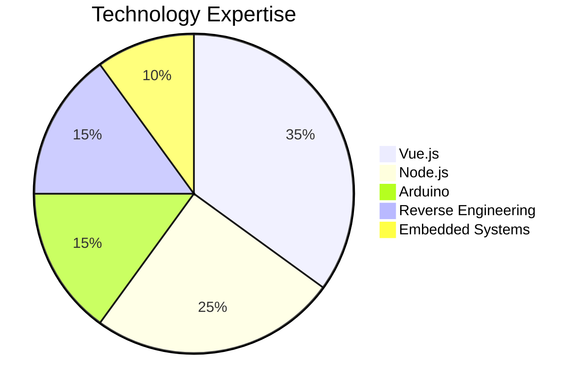

# 🚀 Full-Stack Tech Wizard | IoT & Reverse Engineering Enthusiast

## 👨‍💻 Tech Stack

## 🔬 Specialized Skills
- 🌐 **Full Stack Development**: Vue 3, Vite, Tailwind, Node.js
- 🤖 **IoT & Embedded Systems**: Arduino UNO, ESP32
- 🕵️ **Reverse Engineering**: 
  - Mobile device analysis
  - Legacy Nokia devices
  - Smart device rooting techniques

## 🛠️ Unique Projects & Interests
- 📱 Advanced mobile device modification
- 🔓 Kernel-level system exploration
- 🌈 Cross-platform technology integration

## 🔌 Embedded & Hardware Hacking

## 💡 Current Focus
Bridging software innovation with hardware possibilities, pushing technological boundaries through creative engineering and deep system understanding.

## 📊 GitHub Activity Dashboard

### 🔥 Contribution Insights

### 📈 Coding Activity

### 🍩 Technology Breakdown

---
**"Transforming complex technologies into elegant solutions"**
